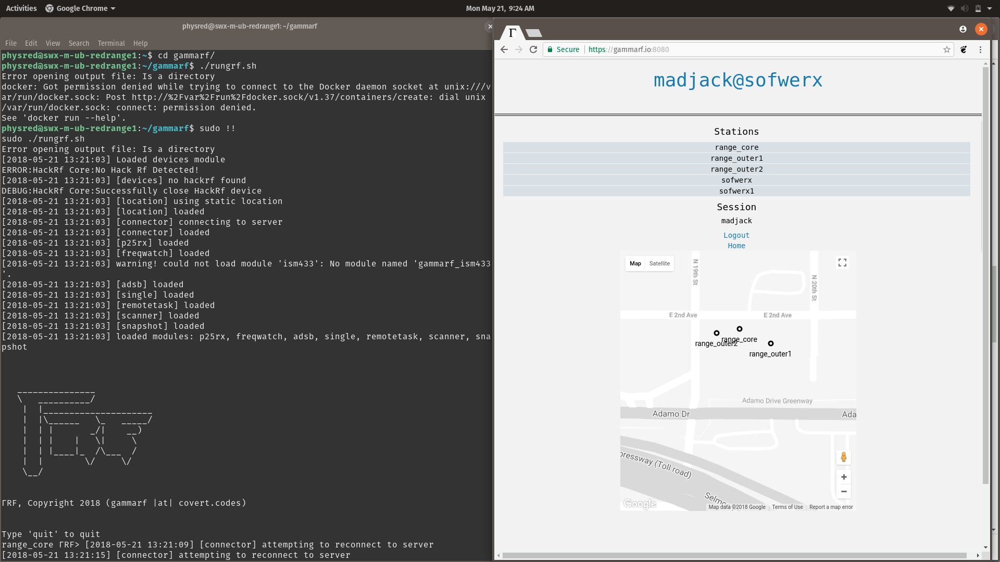

## GammaRF - Setup and Insight
The main piece of software used to control the SDR attached to the computing device for each node is called GammaRF. Through collaboration with the creator of GammaRF, station ID can be created and assigned respectively to the needed stations. If running a custom GammaRF server, station ID's will be provided by the server administrator. Assigning each ID and location with the proper station is important for the software to register the stations recordings, this is done in the config file of the software after it is installed and prepared. To install GammaRF and all its needed libraries following closely the list of [instructions](http://www.gammarf.io/client.html#installation) is important.

After everything is configured and set you would configure the connector module to properly reflect the data streamed over to the GammaRF server toward your database. Navigate to the location where GammaRF is installed, then open the modules folder and find the connector module and substitute it with the one found in this [Repository](https://github.com/sofwerx/es-gammarf/blob/master/gammarf_connector.py). In the place of `GAMMARF_ELASTICSEARCH_URL` write the URL for your database server, in the `GAMMARF_ELASTICSEARCH_USERNAME` write the login (if set), and in `GAMMARF_ELASTICSEARCH _PASSWORD` write the password (if set), for that new gammarf_connecter.py file. With that GammaRF should be prepared once more to update the modules used, and working without any issues.

